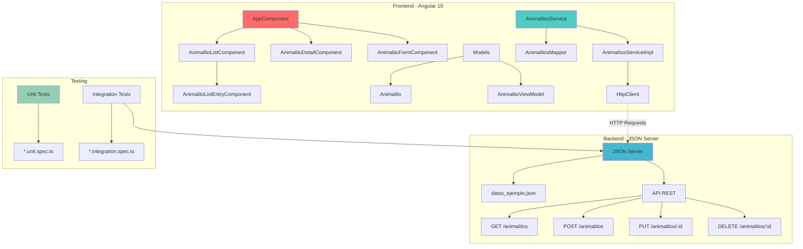

# 🐾 Animalitos CRUD App

Una aplicación completa de gestión de animalitos construida con **Angular 19** y **JSON Server**. Implementa un CRUD completo con arquitectura moderna, pruebas unitarias e integración, y está diseñada siguiendo las mejores prácticas de Angular.

## 🎯 Características

- ✅ **CRUD Completo**: Crear, leer, actualizar y eliminar animalitos
- 🧩 **Componentes Standalone**: Arquitectura moderna sin módulos
- 🎨 **Diseño Responsive**: Interfaz adaptable a diferentes dispositivos
- ⚡ **Validación de Formularios**: Validación reactiva con mensajes de error
- 🧪 **Testing Completo**: Pruebas unitarias e integración
- 🔄 **Estados de Carga**: Indicadores visuales para mejor UX
- 🎭 **Avatares Emoji**: Representación visual de especies
- 📱 **Navigation**: Navegación fluida entre vistas

## 🚀 Inicio Rápido

### Prerrequisitos

- **Node.js** >= 18.x
- **npm** >= 9.x
- **json-server** (se instala automáticamente como dependencia)

### Instalación

```bash
# Clonar el repositorio
git clone <repository-url>
cd animalitos

# Instalar dependencias
npm install

# Iniciar la aplicación completa (frontend + backend)
npm run dev
```

La aplicación estará disponible en:
- **Frontend**: http://localhost:4200
- **Backend API**: http://localhost:3000

### Comandos Disponibles

```bash
# Desarrollo
npm start              # Solo frontend (Angular)
npm run fake-backend   # Solo backend (JSON Server)
npm run dev            # Frontend + Backend juntos

# Testing
npm test                    # Todos los tests en modo watch
npm run test:unit          # Solo tests unitarios
npm run test:integration   # Tests de integración (sin servidor)
npm run test:service:full  # Tests completos con JSON Server

# Construcción
npm run build         # Build de producción
npm run watch         # Build en modo watch
```

## 🏗️ Arquitectura



### Estructura de Directorios

```
src/
├── components/               # Componentes Angular
│   ├── app/                 # Componente principal
│   ├── animalito-list/      # Lista de animalitos
│   ├── animalito-list-entry/# Elemento individual
│   ├── animalito-detail/    # Vista detallada
│   └── animalito-form/      # Formulario CRUD
├── models/                  # Modelos de datos
│   ├── animalito.ts         # Modelo de dominio
│   └── animalito.view.model.ts # Modelo de vista
├── services/                # Servicios
│   ├── animalitos.service.ts    # Servicio abstracto + implementación
│   ├── *.unit.spec.ts           # Tests unitarios
│   └── *.integration.spec.ts    # Tests de integración
├── mappers/                 # Transformadores de datos
│   └── animalitos.mapper.ts
└── config/                  # Configuración
    ├── app.config.ts        # Config principal
    └── app.routes.ts        # Rutas (futuro)

backend/
├── datos_ejemplo.json       # Datos de desarrollo
└── datos_testing.json      # Datos para tests
```

## 📋 API Reference

El backend JSON Server expone los siguientes endpoints:

### Base URL: `http://localhost:3000`

| Método | Endpoint | Descripción | Ejemplo |
|--------|----------|-------------|---------|
| `GET` | `/animalitos` | Obtener todos los animalitos | `curl http://localhost:3000/animalitos` |
| `GET` | `/animalitos/:id` | Obtener un animalito por ID | `curl http://localhost:3000/animalitos/1` |
| `POST` | `/animalitos` | Crear un nuevo animalito | Ver ejemplo abajo |
| `PUT` | `/animalitos/:id` | Actualizar un animalito | Ver ejemplo abajo |
| `DELETE` | `/animalitos/:id` | Eliminar un animalito | `curl -X DELETE http://localhost:3000/animalitos/1` |

### Modelo de Datos

```typescript
interface Animalito {
  id: number;
  nombre: string;
  especie: "Perro" | "Gato" | "Pez" | "Pájaro" | "Hamster" | "Conejo" | "Tortuga";
  edad: number;
  raza: string;
  descripcion?: string;
}
```

### Ejemplos de Uso con curl

#### Crear un nuevo animalito

```bash
curl -X POST http://localhost:3000/animalitos \
  -H "Content-Type: application/json" \
  -d '{
    "nombre": "Rex",
    "especie": "Perro",
    "edad": 5,
    "raza": "Pastor Alemán",
    "descripcion": "Un perro leal y protector"
  }'
```

#### Actualizar un animalito existente

```bash
curl -X PUT http://localhost:3000/animalitos/1 \
  -H "Content-Type: application/json" \
  -d '{
    "id": 1,
    "nombre": "Firulais Actualizado",
    "especie": "Perro",
    "edad": 4,
    "raza": "Labrador Mestizo",
    "descripcion": "Ahora es aún más juguetón!"
  }'
```

#### Poblar la base de datos con ejemplos

```bash
# Agregar un gato
curl -X POST http://localhost:3000/animalitos \
  -H "Content-Type: application/json" \
  -d '{
    "nombre": "Whiskers",
    "especie": "Gato",
    "edad": 3,
    "raza": "Persa",
    "descripcion": "Elegante y peludo"
  }'

# Agregar un pez
curl -X POST http://localhost:3000/animalitos \
  -H "Content-Type: application/json" \
  -d '{
    "nombre": "Burbuja",
    "especie": "Pez",
    "edad": 1,
    "raza": "Goldfish",
    "descripcion": "Nada en círculos todo el día"
  }'

# Agregar un pájaro
curl -X POST http://localhost:3000/animalitos \
  -H "Content-Type: application/json" \
  -d '{
    "nombre": "Piolín",
    "especie": "Pájaro",
    "edad": 2,
    "raza": "Canario",
    "descripcion": "Canta muy bonito por las mañanas"
  }'
```

## 🧪 Testing

La aplicación incluye una suite completa de pruebas:

### Tests Unitarios
- **Cobertura**: Servicios, mappers y lógica de componentes
- **Mocking**: HttpClientTestingModule para peticiones HTTP
- **Principios FIRST**: Fast, Independent, Repeatable, Self-validating, Timely

### Tests de Integración
- **Real HTTP**: Pruebas contra JSON Server real
- **Flujo completo**: Desde frontend hasta backend
- **Cleanup**: Limpieza automática de datos de prueba

```bash
# Ejecutar todos los tests
npm test

# Solo tests unitarios (rápidos)
npm run test:unit

# Tests de integración con servidor real
npm run test:service:full
```

## 🎨 Uso de la Aplicación

### Vista Principal - Lista de Animalitos

- Grid responsive de todos los animalitos
- Botón "Agregar Animalito" para crear nuevos
- Cada tarjeta muestra información básica
- Botones de editar y eliminar en cada entrada

### Vista Detalle

- Avatar emoji según la especie
- Información completa del animalito
- Botones para volver al listado o editar

### Formulario de Creación/Edición

- Validación reactiva en tiempo real
- Dropdown de especies con emojis
- Campo de descripción opcional
- Contadores de caracteres
- Mensajes de error claros

## 🔧 Tecnologías

- **Frontend**: Angular 19, TypeScript, RxJS
- **Styling**: CSS3 con Flexbox/Grid
- **Backend**: JSON Server
- **Testing**: Jasmine, Karma, ChromeHeadless
- **Build**: Angular CLI, Vite
- **HTTP**: HttpClient con interceptores
- **Validation**: Angular Reactive Forms

## 🤝 Contribución

1. Fork del proyecto
2. Crear branch de feature (`git checkout -b feature/nueva-funcionalidad`)
3. Commit de cambios (`git commit -am 'Agregar nueva funcionalidad'`)
4. Push al branch (`git push origin feature/nueva-funcionalidad`)
5. Crear Pull Request

## 📝 Patrones de Desarrollo

- **Dependency Injection**: IoC con providers
- **Repository Pattern**: Abstracción de datos
- **Observer Pattern**: RxJS Observables
- **Component Communication**: @Input/@Output
- **Error Handling**: Try-catch con user feedback
- **Responsive Design**: Mobile-first approach

## 🐛 Troubleshooting

### La aplicación no carga
```bash
# Verificar que ambos servidores estén corriendo
curl http://localhost:4200  # Frontend
curl http://localhost:3000/animalitos  # Backend
```

### Error de CORS
```bash
# JSON Server maneja CORS automáticamente
# Si persiste, reiniciar ambos servidores
npm run dev
```

### Tests fallan
```bash
# Asegurar que JSON Server esté disponible para tests de integración
npm run json-server:test &  # En terminal separado
npm run test:integration
```

---

**Desarrollado con ❤️ y Angular 19** | **Testing con FIRST principles** | **Arquitectura Clean & Modern**
