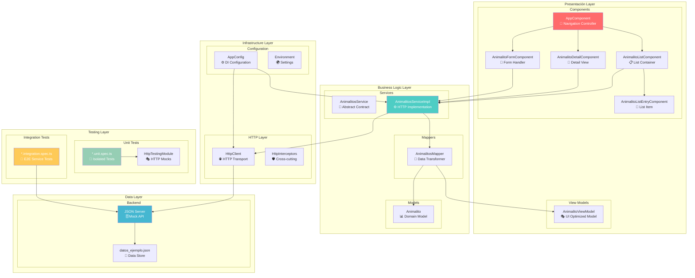
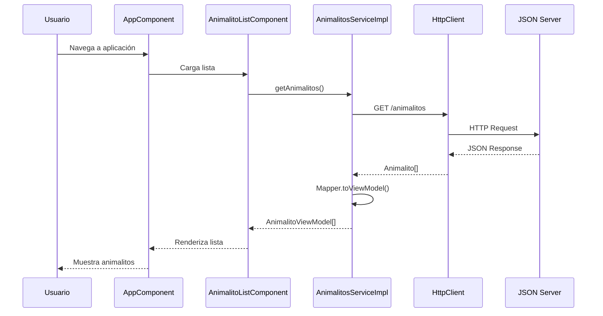
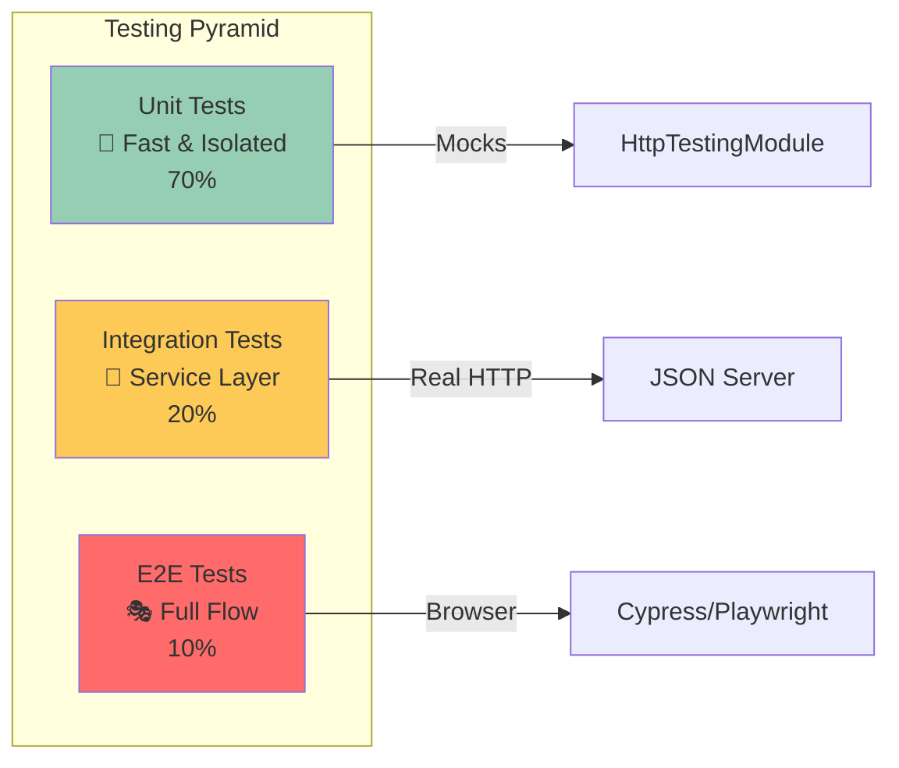

# 🏗️ Arquitectura de la Aplicación Animalitos

## Visión General

La aplicación Animalitos sigue una **arquitectura por capas** con **separación de responsabilidades** clara, implementando patrones modernos de Angular 19.

## Diagrama de Arquitectura Completo



## Patrones de Diseño Implementados

### 1. **Dependency Injection (DI)**
```typescript
// app.config.ts
providers: [
  provideHttpClient(),
  { provide: AnimalitosService, useClass: AnimalitosServiceImpl }
]
```

### 2. **Repository Pattern**
```typescript
// Abstracción
export abstract class AnimalitosService {
  abstract getAnimalitos(): Observable<AnimalitoViewModel[]>;
}

// Implementación concreta
export class AnimalitosServiceImpl extends AnimalitosService {
  constructor(private http: HttpClient) { super(); }
}
```

### 3. **Mapper Pattern**
```typescript
export class AnimalitosMapper {
  static toViewModel(animalito: Animalito): AnimalitoViewModel {
    return new AnimalitoViewModel(/* transformation logic */);
  }
}
```

### 4. **Observer Pattern (RxJS)**
```typescript
getAnimalitos(): Observable<AnimalitoViewModel[]> {
  return this.http.get<Animalito[]>(this.API_URL).pipe(
    map(animalitos => animalitos.map(AnimalitosMapper.toViewModel))
  );
}
```

### 5. **Component Communication**
```typescript
// Parent to Child
@Input() animalito: AnimalitoViewModel | null = null;

// Child to Parent
@Output() saved = new EventEmitter<AnimalitoViewModel>();
```

## Flujo de Datos



## Estructura de Archivos Detallada

```
src/
├── components/                    # 🎨 Capa de Presentación
│   ├── app/                      # 🎯 Componente raíz
│   │   ├── app.component.ts      # Lógica de navegación
│   │   ├── app.component.html    # Template principal
│   │   └── app.component.css     # Estilos globales
│   ├── animalito-list/           # 📋 Lista de animalitos
│   │   ├── animalito-list.component.ts
│   │   ├── animalito-list.component.html
│   │   └── animalito-list.component.css
│   ├── animalito-list-entry/     # 🎴 Elemento de lista
│   ├── animalito-detail/         # 📄 Vista detallada
│   └── animalito-form/           # 📝 Formulario CRUD
├── services/                     # ⚙️ Capa de Lógica de Negocio
│   ├── animalitos.service.ts     # Servicio abstracto + implementación
│   ├── *.unit.spec.ts           # Tests unitarios
│   └── *.integration.spec.ts    # Tests de integración
├── models/                       # 📊 Modelos de Datos
│   ├── animalito.ts             # Modelo de dominio
│   └── animalito.view.model.ts  # Modelo de vista
├── mappers/                      # 🔄 Transformadores
│   └── animalitos.mapper.ts     # Lógica de transformación
└── config/                       # ⚙️ Configuración
    ├── app.config.ts            # Configuración DI
    └── app.routes.ts            # Rutas (futuro)
```

## Principios SOLID Aplicados

### **S** - Single Responsibility Principle
- Cada componente tiene una responsabilidad específica
- Servicios separados para diferentes dominios
- Mappers dedicados solo a transformación

### **O** - Open/Closed Principle
- Servicios abstractos permiten extensión sin modificación
- Nuevas implementaciones sin cambiar contratos

### **L** - Liskov Substitution Principle
- `AnimalitosServiceImpl` es completamente intercambiable con `AnimalitosService`
- Mocks en tests implementan mismas interfaces

### **I** - Interface Segregation Principle
- Interfaces específicas y cohesivas
- No dependencias innecesarias entre componentes

### **D** - Dependency Inversion Principle
- Componentes dependen de abstracciones (`AnimalitosService`)
- No dependen de implementaciones concretas

## Testing Strategy



### Tipos de Tests

1. **Unit Tests** (`*.unit.spec.ts`)
   - Servicios aislados con mocks
   - Lógica de componentes
   - Mappers y utilidades

2. **Integration Tests** (`*.integration.spec.ts`)
   - Flujo completo con HTTP real
   - Interacción con JSON Server
   - Validación de contratos API

## Performance Considerations

- **Lazy Loading**: Componentes standalone para mejor tree-shaking
- **OnPush Strategy**: Estrategia de detección de cambios optimizada
- **HTTP Caching**: Caché de respuestas para reducir peticiones network
- **Bundle Optimization**: Code splitting automático con Angular 19

## Security Measures

- **Input Validation**: Validación de formularios reactiva
- **XSS Protection**: Sanitización automática de Angular
- **CSRF**: Tokens automáticos en peticiones HTTP
- **Content Security Policy**: Headers de seguridad

## Extensibilidad

La arquitectura permite fácil extensión:

- **Nuevas Entidades**: Seguir patrón Service + Mapper + Component
- **Diferentes Backends**: Implementar nueva clase que extienda servicio abstracto  
- **Nuevas Funcionalidades**: Componentes standalone sin impacto en otros
- **Testing**: Tests aislados permiten refactoring seguro

---

**Arquitectura diseñada para escalabilidad, mantenibilidad y testabilidad** 🚀